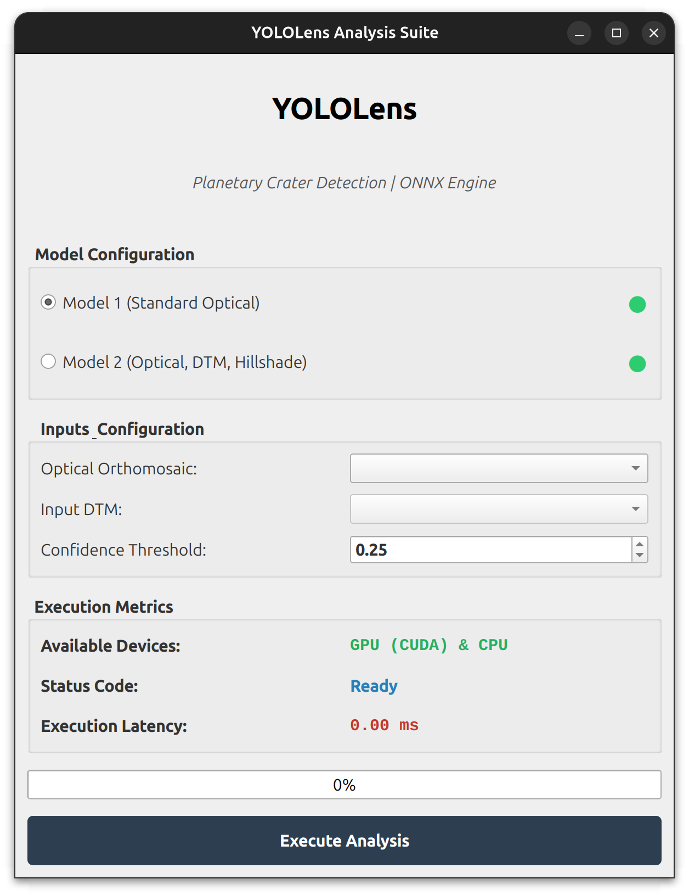

# YOLOLens QGIS Plugin 🛰️🌋

YOLOLens is a QGIS plugin designed for automated crater detection using YOLO-based deep learning models. Since the machine learning weights are too large to be hosted directly on GitHub, please follow the installation procedure below to configure and run the plugin locally.

---

# 🚀 Quick Start Guide

## Step 1 — Download the Pre-trained Models

Before running the plugin, download the required pre-trained `.onnx` and `.pt` model files.

📥 **Download the models from Google Drive:**  
https://drive.google.com/drive/folders/1Qv2VtG53lG7JTX7MxPLhtJj-TZQrNwoy?usp=sharing

---

## Step 2 — Plugin Installation

### 🐧 Linux (Ubuntu) Installation

Clone or copy the repository into the QGIS plugin directory:

```bash
~/.local/share/QGIS/QGIS3/profiles/default/python/plugins/crater_detector/
```

---

## 📂 Create the `models/` Directory

Inside the `crater_detector/` plugin directory:

1. Create a folder named `models/`
2. Place all downloaded `.onnx` and `.pt` files inside this folder

Your final directory structure should resemble:

```plaintext
crater_detector/
├── models/
│   ├── YOLOLens1.onnx
│   └── YOLOLens2.onnx
├── __init__.py
├── crater_detector.py
├── metadata.txt
└── ...
```

---

## Step 3 — Install Dependencies

Open a terminal and install the required Python packages:

```bash
cd ~/.local/share/QGIS/QGIS3/profiles/default/python/plugins/crater_detector/

pip install -r requirements.txt
```

---

# ⚠️ Hardware Requirements (GPU vs CPU)

High-resolution planetary crater detection over large geospatial rasters requires substantial computational resources.

## 💻 GPU Execution (Recommended)

For optimal inference performance:

- Use a dedicated NVIDIA GPU
- Ensure CUDA and cuDNN are correctly installed and configured
- Install GPU-enabled ONNX Runtime dependencies

GPU acceleration significantly improves inference speed and large-scale raster processing.

---

## 🐌 CPU-Only Execution

The plugin can also run without a GPU; however:

- Processing time may increase substantially
- Large raster datasets may require significant execution time
- Memory consumption can become considerable depending on tile resolution

To configure a CPU-only environment, replace the GPU ONNX runtime package with the standard CPU version:

```bash
pip uninstall onnxruntime-gpu
pip install onnxruntime
```

---

# 📚 Documentation

| File                 | Description |
|----------------------|---|
| [specs.md](specs.md) | Technical guide for preprocessing, sliding windows, IoU filtering, and post-processing |

---
# Plugin GUI Example


---

# 🏛️ Institutional Affiliation

This software framework has been developed within the scientific and technological activities of:

**INAF — Istituto Nazionale di Astrofisica**  
(*Italian National Institute for Astrophysics*)

The plugin represents part of an automated planetary mapping and structural remote sensing pipeline focused on deep learning-based crater detection and morphometric analysis.

---

# 📄 Academic Citations

If you use this plugin, the associated models, or derived crater catalogs in scientific publications, research projects, or planetary mapping activities, please cite the following works:

1. **La Grassa R., et al.**  
   *YOLOLens: A deep learning model based on super-resolution to enhance the crater detection of planetary surfaces.*  
   Remote Sensing, 15(5), 1171, 2023.

2. **La Grassa R., et al.**  
   *LU5M812TGT: An AI-Powered Global Database of Impact Craters ≥ 0.4 km on the Moon.*  
   ISPRS Journal of Photogrammetry and Remote Sensing, 220, 75–84, 2025.

3. **La Grassa R., et al.**  
   *From the Moon to Mercury: Release of Global Crater Catalogs Using Multimodal Deep Learning for Crater Detection and Morphometric Analysis.*  
   Remote Sensing, 17(19), 3287, 2025.

---

# 🛠️ Contributing & Support

For:

- bug reports
- performance improvements
- geospatial alignment issues
- feature requests
- support for additional raster or planetary datasets

please email me: riccardo.lagrassa@inaf.it